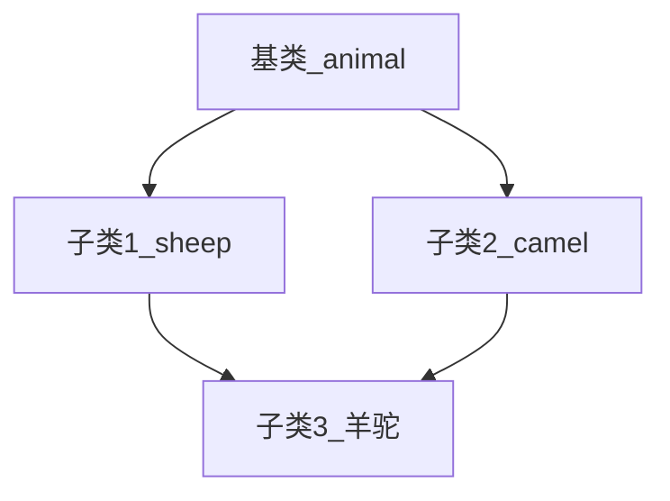

# C++基础

## 1 数据类型

### 1.1 浮点型

| 数据类型 | 占用空间 | 有效数字范围 |
| -------- | -------- | ------------ |
| *float*  | 4字节    | 6-7位        |
| *double* | 8字节    | 15-16位      |

**为什么*float(double)*的有效数字是6-7(15-16)位？**

reference:[浮点型的内存存储](https://www.log2base2.com/storage/how-float-values-are-stored-in-memory.html)

*float* 占用32位，23位尾数位，8位指数位，1位符号位；

*double*占用64位，52位尾数位，11位指数位，1位符号位。

1. **符号位（Sign）：**0代表正数，1代表负数

2. **指数位（Exponent）：**用于存储科学计数法中的指数部分，并且采用移位存储(127+指数)的二进制方式。

3. **尾数位（Mantissa）：**用于存储尾数部分


在计算机中，任何一个数都可以表示成$1.xxxxx\times 2^n$这样的形式，以*float* $(9.125)_{10}$为例：
$$
(9)_2=1001	\\
(0.125)_2=0.001	\\
\therefore(9.125)_{10}=(1001.001)_2=(1.001001\times 2^3)_2(二进制的科学计数方式)
$$
其中，小数点后$xxxxx$ 表示尾数部分，*n*表示指数部分；

小数点前**数字1**，由于任何的一个数表示成这种形式时这里都是1，所以在存储时实际上并不保存这一位，这使得*float*的23bit的尾数可以表示24bit的精度，*double*中52bit的尾数可以表达53bit的精度。

**其有效位数由尾数决定**
$$
2^{23}=8,388,608（7位数字，其绝对能保证6位）	\\
2^{53}=9,007,199,254,740,992(16位数字，其绝对能保证15位)
$$

### 1.2 字符串型

可以选择字符数组或者*string*类型

```c++
#include<iostream>
#include<string>
using namespace std;

char str1[] = "hello char[]";
string str2 = "hello string";	//string类型需要包含<string.h>头文件才能正常输出
```

### 1.3 布尔类型

```c++
bool flag1 = true;
bool flag2 = false;
cout << flag1 << endl;	//1
cout << flag2 << endl;	//0
```

### 1.4 输入输出类型

```c++
float e = 0.0f;
cout << "请给float e赋值：" << endl;
cin >> e;
```

### 1.5 函数高级

#### 1.5.1 函数默认参数

* 在某个位置设定默认参数后，其后面参数必须有默认值
* 函数声明和实现不能**同时有默认参数**

 ```c++
 int func(int a, int b = 20, int c = 30)
 {
 	return a + b + c;
 }
 ```

#### 1.5.2 函数重载

1. **作用**函数名相同，提高代码复用性
2. 函数重载**满足条件**

* 同一作用域
* 函数名相同
* 函数参数类型不同 *or* 参数个数不同 *or* 顺序不同

3. 函数的**返回值不可以**作为函数重载的条件

4. 函数重载注意事项（引用参数和重载函数使用情况），reference[const 修饰引用参数](####2.2.1 引用定义)

```c++
void func_overload(int& a)
{
	cout << "调用了int a 重载函数" << endl;
}
void func_overload(const int& a)
{
	cout << "调用了const int a 重载函数" << endl;
}
int main()
{
	int a = 10;
	cout << "引用参数和重载函数使用" << endl;
	func_overload(a);	//调用了int a 重载函数
	func_overload(20);	//调用了const int a 重载函数
	system("pause");
	return 0;
}
```


## 2 面向对象

C++面向对象的三大特性：**封装、继承、多态**

### 2.1 new堆区

1. **堆区数据**由程序员管理开辟和释放，在C++中利用***new***在堆区开辟内存，因此可用其保存局部变量值；
2. ***new***返回该数据类型指针

#### 2.1.1 栈区堆区变量区别

栈区在调用函数后就会释放，即存储的a也会被释放；堆区由自己开辟，因此返回main后仍然存在，代码示例如下：

```c++
#include<iostream>
#include<string>
using namespace std;

//返回堆区变量
int* getp_heap()
{
	int* p = new int(10);	//使用new在堆区开辟int变量空间，其存储与释放由自身控制
	return p;
}
//返回栈区变量
int* getp_stack()
{
	int a = 12;
	return &a;
}

int main()
{
	int* p1 = getp_heap();
	int* p2 = getp_stack();
	cout << "堆上存储int变量的值为：" << *p1 << endl;	//10
	cout << "堆上存储int变量的值为：" << *p1 << endl;	//10
	cout << "--------------------------------------" << endl;
	cout << "堆上存储int变量的值为：" << *p2 << endl;	//错误数字
	cout << "堆上存储int变量的值为：" << *p2 << endl;	//错误数字
	system("pause");
	return 0;
}
```

#### 2.1.2 delete释放堆区

```c++
int* creatArr()
{
	int* arr = new int[10];
	for (int i = 0; i < 10; i++)
	{
		arr[i] = 100 + i;
	}
	return arr;
}
int main()
{
	int* arr = creatArr();
	for (int i = 0; i < 10; i++)	//输出创建的数组
		cout << arr[i] << endl;
	delete[] arr;	//释放堆区数据，因为arr是数组，所以需加[]
	system("pause");
	return 0;
}
```


### 2.2 C++中的引用

#### 2.2.1 引用定义

**引用**是给变量取别名，其指向变量的同一块内存；而赋值指向两块内存

* `&`引用实质上是一个**指针常量**`int* const a;`

* 引用必须初始化(error:`int &b;`)
* 初始化后，就不能更改

```c++
int main()
{
	int a = 10;
	int &b = a;	//b就是a的别名
	int c = a;
	cout << "变量a地址:" << &a << endl;	//00B8FED4
	cout << "变量b地址:" << &b << endl;	//00B8FED4
	cout << "变量c地址:" << &c << endl;	//00B8FEBC
	system("pause");
	return 0;
}
```

* const修饰引用

```c++
int a = 10;	//int& b = 20;	//error:20在这个计算结束后就会被销毁，引用地址指向一个被销毁的空间
const int& b = 20;	//right:20因为const存在，生命周期延长，所以可以赋值给引用
```

#### 2.2.2 引用作函数参数

使用引用符号修饰形参，其可以达到和地址传递**一样**的效果，**简化了指针计算**，也可以在引用函数参数前加const修饰

```c++
void swap_address(int*a, int*b)	//地址传递
{
	int temp = *a;
	*a = *b;
	*b = temp;
}
void swap_quote(int &a, int &b)	//引用传递
{
	int temp = a;
	a = b;
	b = temp;
}
int main()
{
	int a = 10, b = 20;
	cout << "交换前a=" << a << "\tb=" << b << endl;	//a=10,b=20
	swap_address(&a, &b);
	cout << "地址传递交换a=" << a << "\tb=" << b << endl;	//a=20,b=10
	swap_quote(a, b);
	cout << "引用传递交换a=" << a << "\tb=" << b << endl;	//a=10,b=20
	system("pause");
	return 0;
}
```

#### 2.2.3 引用作返回值

引用作返回值就是返回原对象，不添加引用都是进行拷贝值返回

```c++
类型标识符 &函数名(形参列表及类型说明){函数体}
```


### 2.3 封装

**封装-=类*class***`class 类名{访问权限：属性/行为};`

类的**成员**包括**属性**和**行为**(函数/方法)

#### 2.3.1 访问权限

- ***public：***可以被该类中的函数、子类的函数、友元函数访问，也可以由该类的对象访问；
- ***protected：***可以被该类中的函数、子类的函数、友元函数访问，但不可以由该类的对象访问；
- ***private：***可以被该类中的函数、友元函数访问，但不可以由子类的函数、该类的对象、访问。

***struct成员***默认权限为公共，***class成员***默认权限为私有

#### 2.3.2 属性私有好处

1. 可以自己控制读写权限
2. 对于写权限，我们可以检测数据的有效性

*personally*:可以编写函数接口那种功能

#### 2.3.3 类对象作为类成员

类对象作为类成员时，A和B类构造析构函数的调用顺序是：

1. **A构造函数**
2. **B构造函数**
3. **B析构函数**
4. **A析构函数**

```c++
class A {}
class B
{
    A a;
}
```

#### 2.3.4 静态成员static

静态成员包括：**静态成员变量**和**静态成员函数**，其都受到**访问权限**限制

静态成员变量——`类名::static_a=值;`

* 所有对象共享同一份数据
* 在编译阶段分配内存
* 类内声明，类外初始化

静态成员函数——`类名::static_func();`

* 所有对象共用同一个函数
* 静态成员函数是只能访问静态成员变量（因为假设静态函数能对其他成员进行访问，但是不同对象其成员变量不同，那么这不就造成相互矛盾了）

```c++
class Test
{
public:
	int public_a;
	static int public_static_b;
	//静态函数只能访问静态成员，不能访问public_a
	static void func()
	{
		//public_a = 100;
		public_static_b = 300;
		cout << "调用了静态成员函数" << endl;
	}
private:
	static int private_static_c;
};
/* 静态成员类内声明，类外初始化 ------*/
int Test::public_static_b = 100;

int main()
{
	cout << "初始化的静态成员变量值public_static_b=" << endl;
	cout << Test::public_static_b << endl;

	Test exa1;
	exa1.public_static_b = 200;
	cout << "创建一个对象对静态成员进行修改后,public_static_b=" << endl;
	cout << Test::public_static_b << endl;

	Test::func();
	cout << "调用了静态函数对静态变量进行修改后,public_static_b=" << endl;
	cout << Test::public_static_b << endl;
	system("pause");
	return 0;
}
```

#### 2.3.5 类成员存储方式

空对象

```c++
class Person
{};

int main()
{
	/* C++编译器会给每个空对象也分配一个字节，为了区分空对象占内存的位置*/
	Person p1;
	cout << sizeof(p1) << endl;	//1字节
	system("pause");
	return 0;
}
```

其他对象

```c++
class Person
{
	double a;	//非静态成员变量，属于类的对象内存空间(占8字节)
	static int b;	//静态成员变量，不属于类的对象内存空间（占0字节）
	void func1(){}	//非静态成员函数，不属于类的对象内存空间（占0字节）
	static void func2(){}	//静态成员函数，不属于类的对象内存空间（占0字节）
};
```

#### 2.3.6 this指针

背景：对于非静态成员函数，只有一份函数实例，即多个类对象共用一块代码（从前面[2.3.5 类成员存储方式](####2.3.5 类成员存储方式)可以看到，非静态成员函数，不属于类对象内存空间）。那么当对象调用时，其如何区分是哪个对象调用自己呢

解决：this指针（**指针常量**），其指向被调用的成员函数所属的对象

this指针用途：

* 当形参和成员变量同名时，用this指针来区分
* 在类的非静态成员函数返回对象本身，可使用`return *this`（但是要注意一点，这种形式是值返回，其返回的是p1.age=30后执行拷贝函数所获得的一个对象，不是原来的p1对象）
* 在本例中this指`Person* const this`

```c++
class Person
{
public:
	Person(int age)
	{
		this->age = age;	//当形参和成员变量同名时，用this指针来区分
	}
	int age;
	/* 在类的非静态成员函数返回对象本身，可使用`return *this */
	Person addAge(const Person& p1)
	{
		this->age += p1.age;
		return *this;
	}
};

int main()
{
	Person p1 = Person(18);
	Person p2 = Person(12);
	p1.addAge(p2);
	cout << p1.age << endl;	//p1.age=30;
	system("pause");
	return 0;
}
```

#### 2.3.7 const/mutable常函数和常对象

**常函数**

* 成员函数后加const我们称这个函数为常函数
* 常函数内不可以修改成员属性
* 成员属性声明加关键字mutable后，在常函数中依然可以修改

```c++
class Test
{
public:
	int a;
	mutable int b;	//mutable修饰，在常函数中依然可以修改
	/*常函数，注意常函数const添加位置-----------------------------
	  这里this指针的形式是const Test* const this----------------*/
	void func() const
	{
		//this->a = 10;	//error:常函数内不可以修改成员属性
		this->b = 10;
	}
	void func1()
	{
		cout << "这是一个类成员函数" << endl;
	}
};
```

**常对象**

* 声明对象前加const称该对象为常对象
* 常对象只能调用常函数

```c++
int main()
{
	const Test t1;	//常对象
	//t1.func1();	//error,因为常对象只能调用常函数,因为普通成员函数可以修改属性，这不符合常对象定义
	//t1.a = 20;	//error:因为常对象定义是值不可修改
	t1.b = 20;	//正确,因为类对象有mutable修饰
	system("pause");
	return 0;
}
```

#### 2.3.8 友元

友元`friend`：让一个函数或者类访问另一个类中私有成员

友元的三种实现：

* 全局函数做友元
* 类做友元
* 成员函数做友元(这里似乎涉及类成员函数调用顺序，下面代码顺序稍微变化就不能使用，留个坑后面查找)

```c
class Myhouse;
class Friendgo
{
public:
	Myhouse* house;
	string name;
	Friendgo(string name);
	void VisitHouse();
};

class Myhouse
{
	friend void FriendMing(Myhouse* house);//全局函数做友元
  //friend class Friendgo;	//类做友元
	friend void Friendgo::VisitHouse();	//成员函数做友元
public:
	string LivingRoom;
	Myhouse();
private:
	string BedRoom;
};
//全局函数做友元
void FriendMing(Myhouse* house)
{
	cout << "小明正在访问" << house->LivingRoom << endl;
	cout << "小明正在访问" << house->BedRoom << endl;	//可以访问类私有属性bedroom
}
/*Myhouse函数类内声明，类外实现------------*/
Myhouse:: Myhouse()
{
	this->LivingRoom = "客厅";
	this->BedRoom = "卧室";
}
/* Friendgo函数类内声明，类外实现------------*/
Friendgo::Friendgo(string name)
{
	this->house = new Myhouse;
	this->name = name;
}
void Friendgo::VisitHouse()
{
	cout << this->name << "正在访问" << this->house->LivingRoom << endl;
	cout << this->name << "正在访问" << this->house->BedRoom << endl;	//可以访问类私有属性bedroom
}

int main()
{
	Myhouse house;
	FriendMing(&house);

	Friendgo friendWang = Friendgo("小王");
	friendWang.VisitHouse();


	system("pause");
	return 0;
}
```


### 2.4 构造函数的分类及调用

* 构造和析构都是必须有的实现，如果我们自己不提供，编译器会提供一个空实现的构造和析构

* 默认情况下，C++编译器至少给一个类添加3个函数(**默认构造函数**，**默认析构函数**，**默认拷贝构造函数**，对属性进行值拷贝)
* 构造函数调用规则：
* (如果用户定义**有参构造**，C++不再提供**默认无参构造**，但会提供**默认拷贝构造**)
* (如果用户定义拷贝构造函数，C++不会再提供其他构造函数)

#### 2.4.1 构造函数

主要作用在于创建对象时为对象的成员属性赋值`类名(){}`

1. 没有返回值也不写void
2. 可以有参数，可以发生重载
3. 程序在创建对象自动调用构造，只会调用一次
4. 有无参，有参，拷贝构造

```c++
class Person 
{
public:
	int age;
	//无参构造
	Person()
	{
		cout << "无参构造函数调用" << endl;
	}
	//有参构造
	Person(int a)
	{
		age = a;
		cout << "有参构造函数调用" << endl;
	}
	//拷贝构造
	Person(const Person &p)	//注意这里参数传递的写法
	{
		age = p.age;
		cout << "拷贝构造函数调用" << endl;
	}
};
int main()
{
	Person p1;	//不要写成Person p1();会认为是函数的声明
	Person p2 = Person(10);	//有参
	Person p3 = Person(p2);	//拷贝
	system("pause");
	return 0;
}
```

构造函数的三种常见形式：

```c++
//括号法，常用
Person p0;	//调用无参构造函数不能加括号，如果加了编译器认为这是一个函数声明
Person p1(10);

//显式法
Person p2=Person(10);	
Person p3=Person(p2);
//匿名对象
Person(10);	//构建了一个匿名对象，当前行结束之后，马上析构
//Person(p2);	//不能利用拷贝构造函数初始化匿名对象，编译器会认为是对象声明，即Person p2,编译器报错重复定义

//隐式转换法
Person p4=10;	//类似Person p4=Person(10);

```


#### 2.4.2 析构函数

主要作用在于对象销毁前系统自动调用`~类名(){}`

1. 没有返回值也不写void
2. 不能有参数，因此不能发生重载
3. 程序在对象销毁前会自动调用析构，只会调用一次

#### 2.4.3 拷贝构造

C++调用拷贝构造有三种情况：

1. 使用一个已经创建完毕的对象来初始化一个新对象
2. 值传递的方式给函数参数传值
3. 以值方式返回局部对象

```c++
//值传递的方式给函数参数传值
void func1(Person p)
{
	cout << "验证类在值传递时是否调用拷贝构造函数" << endl;
}
//以值方式返回局部对象
Person func2(int a)
{
	Person p;
	p.age = a;
	cout << "验证以值方式返回类时是否调用拷贝构造函数" << endl;
	return p;
}
```

所以这也解释了**拷贝构造函数为什么要用引用传值**，这是构造函数本身规定的，因为实际类的值传递就是调用拷贝函数进行赋值的，而我们现在就在构建拷贝函数，那不就是先有鸡先有蛋的问题了吗

```c++
//拷贝构造用引用传递
Person(const Person &p)	//注意这里参数传递的写法
{
    age = p.age;
    cout << "拷贝构造函数调用" << endl;
}
```


#### 2.4.4 深拷贝和浅拷贝

**浅拷贝**：简单的赋值拷贝操作

**深拷贝**：在堆区重新申请空间，进行拷贝操作

这里解释下**为什么**会用到深拷贝：

1. 成员变量为指针时，注释写了为什么只能将指针指向堆区
2. 析构函数重写：因为堆区需要释放
3. 拷贝函数重写：参考拷贝构造前注释，浅拷贝指向同一块堆区，会在析构时引发报错，因此我们必须将拷贝的类指向新的堆区

* **总结：在成员变量为指针时，我们要用到深拷贝和析构函数重写**

```c++
class Person
{
public:
	int age;
	int* height;
	//有参构造
	Person(int a,int h)
	{
		age = a;
		/* 这里只能使用堆区，第一种：如果改为*height=h;则指针没有初始化，会报错;
		   第二种，height=&h，不可取，这是值传递，会在调用函数后释放*/
		height = new int(h);		
	}
	/* 在构造函数里有堆区时，要采用深拷贝，而不能默认浅拷贝
	   因为浅拷贝获得的类指向同一块堆区，在释放堆区时，就会重复释放，引发报错*/
	Person(const Person &p)	
	{						
		age = p.age;
		height = new int(*p.height);
	}
	//析构函数(因为前面构造了堆区，这里要释放堆区)
	~Person()
	{
		if (height != NULL)
		{
			delete height;
			height = NULL;	//记得将其改为NULL
		}
	}
};

int main()
{
	Person p1 = Person(20, 160);
	Person p_copy = Person(p1);
	cout << "指针p1.height地址=" << p1.height << endl;	//0121F980
	cout << "指针p_copy.height地址=" <<p_copy.height << endl;	//0121F9B0 两者不一样
	cout << "p1.height=" << *p1.height << endl;	//160
	cout << "p_copy.height=" << *p_copy.height << endl;	//160 两者值一样
	system("pause");
	return 0;
}
```

### 2.5 运算符重载

对已有的运算符重新进行定义，以适应不同的数据类型

#### 2.5.1 加号运算符重载(+)

1. 成员函数里重载
2. 全局函数重载

```c++
//成员函数里重载
Test operator+(const Test& t2)
	{
		this->a += t2.a;
		this->b += t2.b;
		return *this;
	}
//成员函数——加号运算符调用
Test t3 = t1.operator+(t2);
//可以简写为
Test t3 = t1 + t2;
```

```c++
//全局函数重载
Test operator+(const Test& t1, const Test& t2)
{
	Test t3;
	t3.a = t1.a + t2.a;
	t3.b = t1.b + t2.b;
	return t3;
}
//成员函数——加号运算符调用
Test t4 = operator+(t1, t2);
//可以简写为
Test t4 = t1 + t2;
```

#### 2.5.2 左移运算符(<<)

下面这段代码可以方便理解输出流，cout是输出流的一个对象

重载左移运算符配合友元可以输出自定义数据类型

```c++
//左移运算符重载
class Test
{
	friend ostream& operator<<(ostream &out, const Test& t1);
private:
	int a;
	int b;
public:
	Test(int a, int b)
	{
		this->a = a;
		this->b = b;
	}
};
//全局函数
ostream& operator<<(ostream &out, const Test& t1)
{
	out << "t1.a=" << t1.a << "  t1.b=" << t1.b << endl;
	return out;
}
int main()
{
	Test t1 = Test(1, 2);
	cout << t1 << "左移运算符重载" << endl;
	
	system("pause");
	return 0;
}
```

#### 2.5.3 递增运算符(++)

下面这种要注意两种情况：

1. 前置和后置为了实现重载，加入了***int***占位符
2. 前置和后置自增返回值的情形不一样，一种返回指针，一种以值方式传递

```c++
class Test
{
	friend ostream& operator<< (ostream& out, const Test t1);
	int i;
public:
	Test()
	{
		i = 0;
	}
	//自增运算——前置运算
	Test& operator++()
	{
		this->i = this->i + 1;
		return *this;
	}
	//自增运算——后置运算(为了区别前置运算实现重载，需要加入int占位符)
	Test operator++(int)
	{
		Test temp = *this;
		this->i = this->i + 1;
		return temp;
	}
};
ostream& operator<< (ostream& out, const Test t1)
{
	out << t1.i;
	return out;
}
//递增运算符
int main()
{
	Test t1;
	cout << t1 << endl;	//0
	cout << ++t1 << endl;	//1
	Test t2;
	cout << t2 << endl;	//0
	cout << t2++ << endl;	//0,t2=1
	cout << (t2++)++ << endl;	//1,t2=2
	cout << t2 << endl;	//t2=2
	cout << ((t2++)++)++ << endl;	//2,t2=2
	cout << t2 << endl;	//t2=3
	int i = 0;
	//int a = (i++)++;	//error:情况与重载++运算符情况相同，返回的是一个栈空间值，不能继续自增
	//int b = ++(++i);
	cout << "i=" << i << endl;
	system("pause");
	return 0;
}
```

#### 2.5.4 赋值运算符(=)

 赋值运算符*operator=*，对属性进行值拷贝，因此，在结构体相互赋值时，存在深浅拷贝问题，此处原理和[深拷贝和浅拷贝](####2.4.4 深拷贝和浅拷贝)，不再做重复记录

#### 2.5.5 关系运算符(== !=)

用来比较类相等或不等，较简单，代码省略

#### 2.5.6 函数调用运算符()

()也可以重载，由于重载后使用的方式非常像函数的调用，因此称为**仿函数**

仿函数没有固定写法，非常灵活

```c++
class Test
{
public:
	//重载函数调用符()
	int operator()(int a,int b)
	{
		return a + b;
	}
};

int main()
{
	//匿名对象调用——Test()就创建了一个匿名对象，在该行语句结束后被析构
	int result = Test()(2, 3);
	cout << "result=" << result << endl;
	system("pause");
	return 0;
}
```

### 2.6 继承

减少重复代码；语法：`class 子类：继承方式 父类`

继承方式：[2.3.1 访问权限](####2.3.1 访问权限)


关于子类继承的属性：

1. 父类中所有非静态成员属性都会被子类继承下去
2. 父类中privete成员属性 被编译器给隐藏了，因此是访问不到的，但确实被子类继承了

如下代码，子类包含了父类的所有成员，所以内存为16字节

```c++
class Baseclass
{
public:
	int a;
protected:
	int b;
private:
	int c;
};
/* 1.父类中所有非静态成员属性都会被子类继承下去
   2.父类中privete成员属性 被编译器给隐藏了，因此是访问不到的，但确实被子类继承了 */
class Son :protected Baseclass
{
public:
	int d;
};

int main()
{
	cout << "sizeof(Son)=" << sizeof(Son) << endl;	//sizeof(Son)=16
	system("pause");
	return 0;
}
```

通过**VS2015 开发命令提示可以看到每个类的实际情况**


#### 2.6.1 构造析构顺序

1. 父类构造函数
2. 子类构造函数
3. 子类析构函数
4. 父类析构函数

#### 2.6.2 同名成员

1. 子类对象可以直接访问到子类中同名成员

2. 子类对象加作用域可以访问到父类同名成员
3. 当子类与父类拥有同名的成员函数，子类会隐藏父类中同名成员函数，加作用域可以访问到父类中同名函数
4. 对于静态成员，访问父类静态成员方法同普通成员一样，不过要注意**通过类名**访问父类静态成员这种情况

```c++
class Baseclass
{
public:
	int a;
	static int b;
	Baseclass()
	{
		a = 100;
	}
	void func()
	{
		cout << "调用了基类中的函数" << endl;
	}
};
int Baseclass::b = 10;
class Son :public Baseclass
{
public:
	int a;
	static int b;
	Son()
	{
		a = 200;
	}
	void func()
	{
		cout << "调用了子类中的函数" << endl;
	}
};
int Baseclass::b = 20;

int main()
{
	Son son1;
	cout << "son1.a=" << son1.a << endl;	//子类对象可以直接访问到子类中同名成员
	cout << "Baseclass.a=" << son1.Baseclass::a << endl;	//子类对象，加作用域，可访问到父类同名成员
	son1.func();	//直接调用，调用子类中的函数
	son1.Baseclass::func();	//加作用域，调用基类同名函数
	//静态同名成员访问
	cout << "静态同名成员访问" << endl;
	cout << "son1.(static)b=" << Son::b << endl;	//类访问静态函数
	cout << "Baseclass.b=" << Son::Baseclass::b << endl;	//第一个::表示通过类名方式访问，第二个::表示通过父类作用域访问
	system("pause");
	return 0;
}
```

#### 2.6.3 多继承语法和菱形继承

c++允许一个类继承多个类，语法：`class 子类：继承方式 父类1， 继承方式 父类2`

**C++实际开发中不建议用多继承**：会引发父类中有同名成员出现，需要加作用域区分

----

**菱形继承概念：**

* 两个派生类继承同一个基类
* 又有某个类同时继承两个派生类



**菱形继承问题:**

* 菱形带来的主要问题是子类继承两份相同数据，导致资源浪费以及毫无意义

```c++
//tuo.age = 18;	//error，报错age不明确，因为其继承了sheep类和Camel类的age
```


**虚继承：**

给间接基类加上关键字**virtual**后子类只保留一份间接基类的成员

* 在虚继承的类中，会定义一个**虚基表指针vbptr(virtual base pointer)**，**指向虚基表**

参考[C++语法——详解虚继承-CSDN博客](https://blog.csdn.net/weixin_61857742/article/details/127344922?spm=1001.2101.3001.6650.1&utm_medium=distribute.pc_relevant.none-task-blog-2~default~CTRLIST~Rate-1-127344922-blog-125971934.235^v39^pc_relevant_default_base&depth_1-utm_source=distribute.pc_relevant.none-task-blog-2~default~CTRLIST~Rate-1-127344922-blog-125971934.235^v39^pc_relevant_default_base&utm_relevant_index=2)

```c++
//创建菱形继承
class Animal
{
public:
	int age;
};
class Sheep :virtual public Animal{};
class Camel :virtual public Animal {};
class Yangtuo :public Sheep, public Camel {};

int main()
{
	Yangtuo tuo;
	//tuo.age = 18;	//error，报错age不明确，因为其继承了sheep类和Camel类的age
	tuo.age = 18;	//采用虚继承，不会报错
	system("pause");
	return 0;
}
```


### 2.6.4 虚继承

* vbptr(virtual base pointer)虚基表指针，其指向虚基表，而虚基表内存有一个偏移量，可让其从间接父类转向父类(class A)


**注意事项**

1. 无意义的虚继承


2. 可用的虚继承


## 实际应用

### 1 函数分文件编写

1. 假设我们目前在***main.c***文件需要调用一个函数***func()***，在团队合作中，该***func()***实现通常由另一位协作者实现在***a.c***文档中，为了调用该函数，我们需要将***func()声明***写在***a.h***中，并在***main.c***包含***a.h***（也就是将函数声明包含进main函数里）

2. 同时我们要注意***a.c***文件也要包含***a.h***，让编译器检查定义和声明的一致性（这里意思就是只有函数定义和声明在同一文件，编译器才能检查你的声明和定义是否一致；如果不在同一文件，编译器无法判断你是否声明和定义一致，就算错了也无法报错，后面改b ug就很麻烦）

***main.c***

```c++
//main.c
#include"02compare.h"

int main()
{
	int a = 0, b = 0;
	cout << "a=" << endl;
	cin >> a;
	cout << "b=" << endl;
	cin >> b;
	int result = compare(a, b);
	cout << "a和b更大的数为" << result << endl;
	system("pause");
	return 0;
```

***a.h***

```c++
//comapre.h
#include<iostream>
#include<string>
using namespace std;

//声明比较函数
int compare(int a, int b);
```

***a.c***

```c++
#include"02compare.h"

//返回更大的那个整数
int compare(int a, int b)
{
	return a > b ? a : b;
}
```

### 2 面向对象

#### 2.1 空指针访问成员函数

c++中空指针也可以调用成员函数，如果成员函数会用到this指针，会error,因此需要加代码以保证代码健壮性（如下面代码所示）

```c++
class Test
{
public:
	int a = 2;
	void func1()
	{
		cout << "这个成员函数没有属性变量也就没有用到this指针" << endl;
	}
	void func2()
	{
		//需要加上下面判断增强代码健壮性
		if (this == NULL)
			return;
		cout << "这个成员函数用到了成员变量this->a=" << this->a << endl;
	}
};

int main()
{
	Test *t = NULL;
	t->func1();	//可以运行
	t->func2();	//没有加if判断会中断
	system("pause");
	return 0;
}
```

#### 2.2 不同类和类的成员函数内存存储

**留坑**：[2.3.8 友元](####2.3.8 友元)
